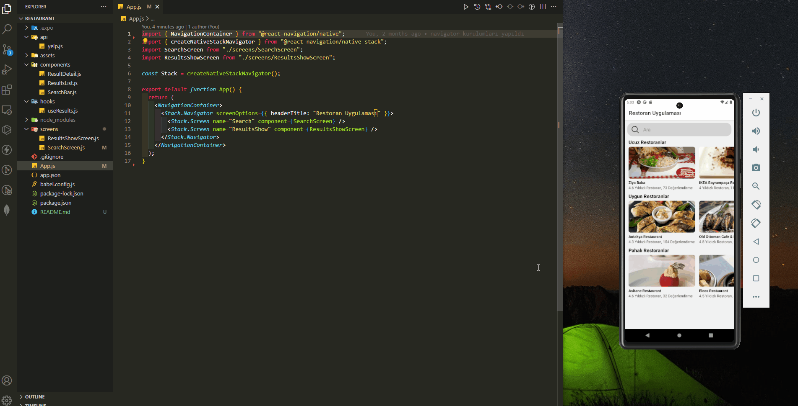
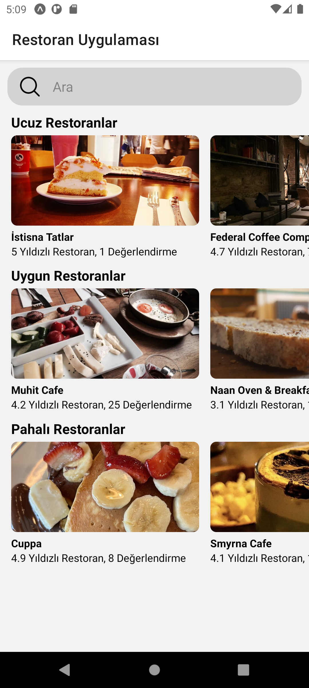
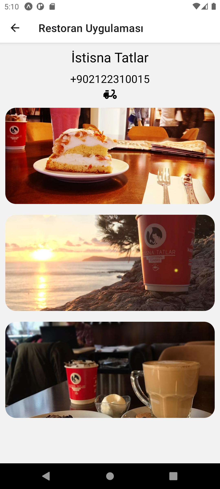

# Restaurant Search App

<div align="center">
  
</div>

## About the Project

This React Native app allows users to search for restaurants in Istanbul and view details about them.

## Table of Contents

- [Technologies Used](#technologies-used)
- [Usage](#usage)
- [Project Skeleton](#project-skeleton)
- [Screenshots](#screenshots)

## Technologies Used

- [Expo](https://expo.dev/): Development platform for mobile apps and web.
- [React Native](https://reactnative.dev/): Framework for building native apps using React.
- [React Navigation](https://reactnavigation.org/): Routing and navigation library for React Native apps.
- [Axios](https://axios-http.com/): Promise-based HTTP client for making requests.
- [Yelp API](https://www.yelp.com/developers/documentation/v3): API for retrieving restaurant data.

## Usage

- Use the search bar to search for restaurants by name.
- Tap on a restaurant to view more details about it, such as its name, phone number, and photos.
- Restaurants are categorized by price: "₺" (cheap), "₺₺" (moderate), and "₺₺₺" (expensive).

## Technologies Used

```
Restaurant Search App (folder)
│
├── api
│     └── yelp.js
├── assets
│     └── [images]
├── components
│     ├── ResultDetail.js    
│     ├── ResultList.js   
│     └── SearchBar.js
├── hooks 
│     └── useResults.js
├── screens
│     ├── ResultShowScreen.js    
│     └── SearchScreen.js
├── .gitignore
├── App.js
├── app.json
├── babel.config.js
├── package-lock.json
├── package.json
└── README.md
```

## Screenshots

<div align="center">
  
  
</div>